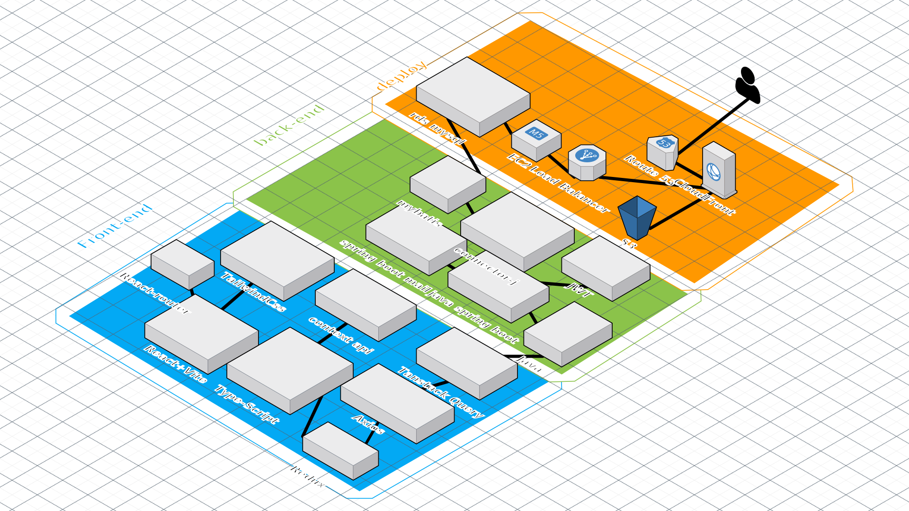

<!-- @format -->

#  - Ai 기반 실시간 모의면접 매칭 서비스

## 프로젝트 개요 

### 취업 준비생 들을위한 모의면접 매칭 시스템(프로젝트 소개 및 선택 이유)

_취준생들이 취업 준비를 위한 면접을 체험하고 싶으신가요?\
취준을 위한 면접 준비가 필요한데 적절한 상대가 없으신가요?\
면접을 준비하기 위한, 필요한 면접매칭을 도와주고\
채팅을 이용하여 간단한대화, 화상챗을 이용한 모의면접\
ai로 이력서 기반 질문생성으로 면접관들에게 질문에 대한 도움을주고\
직접 이력서를 보고 질문을 추가적으로 생성하여 질문을 할수있고, 그 질문에 대한 피드백을 작성해 도움을 줄수 있습니다.\
jobdam은 이들에게 면접에 필요한 서비스를 제공합니다._

### 협업과정

> 1. 기본적으로 디스코드 + 노션을 활용하였고,디자이너와 협업을 위한 피그마까지  활용하였다. 디스코드에선 채널 분리를 하여
> 실시간 소통을하였다.(직군별 페이지,error 공유 페이지, 진행상황 공유 페이지 등) 노션에서는 문서화가 필요한 소통을 하였다.
> (api, error 정리 ) 피그마에선 디자인을 해놓으면 회의때 궁금한것이나 필요한것들을 피그마에 직접 멘트를 달고 , 답장을 
> 하는식으로 진행하였고 프론트, 백엔드 요구사항등은 디스코드에 남겼다.
> 2. 프론트에선 백엔드를위해서 폴더구조에 대한 간단한 설명을 README로 작성하여 프론트를 작성할때 참고 할수있도록 하였다.

## 기술스택

> 1. 백엔드와 의 협업을 위해 + csr 정도면 충분한거같아서 React+vite+typescript를 채택하였다.
> 2. 프로젝트 특성상 node.js를 사용하는게 맞고(실시간 서비스), 풀스택으로 할줄알지만, 
> 백엔드 팀원들이 java 를 사용해서 java spring boot 프레임워크 를 사용하였다.
> 3. 리액트 쿼리 훅을 사용하여 client와 server를 분리하여 관리하였다.
> 4. rhf - 리액트 훅 폼 을 사용하여, 로그인 로그아웃 등 데이터를 입력하는 post부분에 대해서 간편하게 관리
> 해주는 툴이다. 리액트 훅 폼을 훅으로 만들었고 form과 관련된 ui는 상태 관리 툴중에 하나인 context api로 관리한다.
> 나머지는 redux 를 통해 관리
> 5. ui 관련해선 radxi/ui 를통해 틀을잡았고, tailwindcss 로 전체적으로 스타일링을 했다.
> 6. vercel 을 활용하여 serverless로 구성 open ai를 자바를 사용하지않고 구성하였다. open ai를 통해 번역기를 만들었다.

## 아키텍쳐

## 주요기능

### 매칭 기능

### 비디오 챗

### 채팅 기능

## 기여도와 역할

## 결과 및 성과

디자이너와는 처음 협업을 하였는데 디자이너랑 같이하니까 확실히 ui가 훨씬더 깔끔해졌다. 

##  향후 계획, 프로젝트를 통해 배운점, 프로젝트에서 문제점을 해결한 과정, 프로젝트의 개선점, 확장성등을 이야기 해도 된다.
